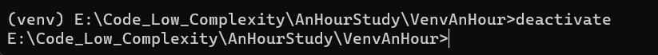

## 创建虚拟环境

在 Windows 系统中，我们也可以使用 `venv` 模块创建虚拟环境。这里是如何操作的：

首先，打开命令提示符（cmd）。然后，输入以下命令：

```python
python -m venv /path/to/new/virtual/environment
```
这里的 "/path/to/new/virtual/environment" 是你要创建新虚拟环境的[目录路径](https://zhida.zhihu.com/search?q=%E7%9B%AE%E5%BD%95%E8%B7%AF%E5%BE%84&zhida_source=entity&is_preview=1)。

这条命令的工作原理是这样的：

* `python -m` 是调用 Python 并使用 `-m` 选项来运行后面指定的模块。在这个例子中，我们运行的是 `venv` 模块。
* `venv` 是 Python 的一个内置模块，用于创建虚拟环境。
* `/path/to/new/virtual/environment` 是你想要创建的新虚拟环境的路径。在这个路径下，Python 会创建一个新的目录，并在这个目录下设置好虚拟环境。

实际上，将虚拟环境（venv）放在项目目录中是一种非常常见的做法，这样做可以确保项目的依赖性更好地被隔离和管理。

例如，如果你的项目目录是 "my\_project"，你可以在这个目录中创建一个名为 "venv" 的虚拟环境，命令如下：

```python
cd my_project
python -m venv venv
```
上述命令首先将[当前目录](https://zhida.zhihu.com/search?q=%E5%BD%93%E5%89%8D%E7%9B%AE%E5%BD%95&zhida_source=entity&is_preview=1)切换到 "my\_project"，然后在这个目录下创建一个名为 "venv" 的虚拟环境。这样，这个虚拟环境就和你的项目在同一个目录下了。

后面那个 `venv` 相当于 `.\venv`， 这两个是一样的。

当你运行 `python -m venv .\myenv` 命令时，如果 "myenv" 文件夹不存在，那么 venv 会自动创建它。所以你不需要提前手动创建 "myenv" 文件夹。如果 "myenv" 文件夹已经存在，venv 会在这个已经存在的文件夹中创建虚拟环境。但是请注意，如果 "myenv" 文件夹已经存在并且其中包含一些文件，那么这些文件可能会被 venv 的创建过程所覆盖或删除。因此，最好确保 "myenv" 文件夹在创建虚拟环境之前是空的。

当你创建一个新的虚拟环境（如venv）时，它会包含一个新的、独立的Python解释器，这个解释器的版本与你创建虚拟环境时使用的Python解释器的版本一致。这意味着虚拟环境中的Python是独立的，不会与系统其他地方的Python冲突。

运行结果

```python
E:\Code_Low_Complexity\AnHourStudy\VenvAnHour>python -m venv venv

E:\Code_Low_Complexity\AnHourStudy\VenvAnHour>dir
 驱动器 E 中的卷是 document
 卷的序列号是 64FF-EEA1

 E:\Code_Low_Complexity\AnHourStudy\VenvAnHour 的目录

2023/07/17  01:04    <DIR>          .
2023/07/17  01:01    <DIR>          ..
2023/07/17  01:04    <DIR>          venv
               0 个文件              0 字节
               3 个目录 119,826,124,800 可用字节

E:\Code_Low_Complexity\AnHourStudy\VenvAnHour>
```
## 激活虚拟环境

在Windows上，你可以通过命令行来激活你的虚拟环境。首先，确保你的命令行的当前工作目录是你的虚拟环境所在的目录。然后，执行如下命令：

```python
venv\Scripts\activate
```
这条命令会激活名为 "venv" 的虚拟环境。在激活虚拟环境后，你的命令行提示符应该会改变，前面会加上虚拟环境的名字，看起来应该像这样：

```python
(venv) C:\path\to\your\project>
```
前面的 `(venv)` 就表示 "venv" 虚拟环境当前正在被使用。此时，你在命令行中执行的任何 Python 和 pip 命令都将在这个虚拟环境中运行。

当你想退出虚拟环境时，只需要在命令行中输入 `[deactivate](https://zhida.zhihu.com/search?q=deactivate&zhida_source=entity&is_preview=1)`，然后按回车键即可。


## 使用虚拟环境

在虚拟环境中安装 Python 包时，我们需要首先确保虚拟环境已被激活。虚拟环境激活后，你的命令行提示符将显示当前激活的虚拟环境的名字。

例如，如果你的虚拟环境的名字是 `myenv`，在 Windows 系统中，激活虚拟环境后的命令行提示符可能会看起来像这样：`(myenv) C:\Users\YourUsername\>`

这时，你可以使用 `pip` 命令来安装 Python 包，如 `numpy` 和 `pandas`。运行以下命令：

```python
pip install numpy
pip install pandas
```
由于你已经在虚拟环境中，`pip` 命令会将这些包安装到当前激活的虚拟环境，而非全局环境。你可以通过运行 `pip list` 命令来查看已在虚拟环境中安装的 Python 包。你应该能在列表中看到 `numpy` 和 `pandas`。

这种方式允许每个项目有其自己的独立环境，并可以安装不同版本的包，而不会影响其他项目或全局 Python 环境。这对于管理项目的依赖性和避免版本冲突非常有帮助。

## 写入requirement文件

```python
安装python第三方库
------------
    pip install -r requirements.txt --upgrade
```
将虚拟环境中安装的所有包写入 `requirements.txt`，可以使用以下方法：

### 使用 `pip freeze`

1. 激活你的虚拟环境：

```python
# Linux/macOS
source venv/bin/activate

# Windows
.\venv\Scripts\activate
```
2. 使用 `pip freeze` 命令导出所有已安装的包及其版本到 `requirements.txt`：

```python
pip freeze > requirements.txt
```
此命令会将虚拟环境中的所有包记录到 `requirements.txt`，文件内容示例如下：

```python
flask==2.0.1
requests==2.26.0
numpy==1.21.0
```
3. 完成后，退出虚拟环境：

```python
deactivate
```
## 退出虚拟环境

退出虚拟环境非常简单，只需要在命令行中输入 `deactivate` 命令即可。在 Windows 中，你可以在命令行提示符中直接输入此命令：

```python
deactivate
```
运行该命令后，你将从当前激活的虚拟环境中退出，并返回到全局 Python 环境。你可以通过查看命令行提示符来确认是否已退出虚拟环境。如果虚拟环境名称不再显示在命令行提示符中，那么你已成功退出虚拟环境。

请注意，退出虚拟环境并不会删除或影响虚拟环境中的任何内容。你可以随时通过激活命令重新进入虚拟环境，继续在其中工作。



## 项目实战

这个任务主要包含以下几个步骤：

**创建并激活虚拟环境**：在命令行中，你可以使用以下命令在当前目录创建一个名为 `myenv` 的虚拟环境，并激活它：

```python
python -m venv venv
venv\Scripts\activate
```
**安装 requests 和 beautifulsoup4 这两个库**：在虚拟环境中，你可以使用 pip 命令来安装 Python 包。在这个案例中，你需要安装 requests 和 beautifulsoup4 这两个库，可以使用以下命令完成：

```python
pip install requests beautifulsoup4
```
