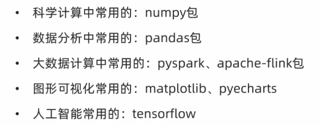

包就是一个文件夹, 该文件夹下必须包含一个`\_\_init\_\_.py`文件, 该文件夹包含多个模块文件. 从逻辑上看, 包的本质依然是模块

```python
# 其它包通过 from my_package import * 时, 只能导入my_module1
__all__ = ['my_module1']
```
# 导入包

```python
import my_package.my_module1
import my_package.my_module2

my_package.my_module1.info_print1()
my_package.my_module2.info_print2()

from my_package import my_module1
from my_package import my_module2

info_print1()
info_print2()
```
# 常用第三方包



