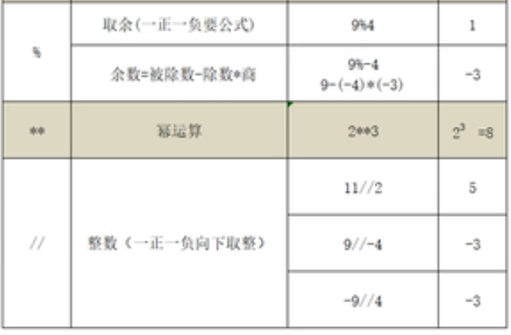

# input函数

```python
a = input('请输入a：\n') #3
b = input('请输入b: \n') #4
print(a + b) # 输出 34 因为input返回的是str类型

c = int(input('请输入a：\n'))
d = int(input('请输入b: \n'))
print(c + d) # 7
```
# 运算符

|  |  |
| --- | --- |
| **运算符** | **描述** |
| `[]``[:]` | 索引、切片 |
| `\*\*` | 幂 |
| `~``+``-` | 按位取反、正号、负号 |
| `\*``/``%``//` | 乘、除、模、整除 |
| `+``-` | 加、减 |
| `>>``<<` | 右移、左移 |
| `&` | 按位与 |
| `^`` | ` |
| `<=``<``>``>=` | 小于等于、小于、大于、大于等于 |
| `==``!=` | 等于、不等于 |
| `is``is not` | 身份运算符 |
| `in``not in` | 成员运算符 |
| `not``or``and` | 逻辑运算符 |
| `=``+=``-=``\*=``/=``%=``//=``\*\*=``&=``|=``^=``>>=``<<=` | 赋值运算符 |

Python 3.8 中引入了一个新的赋值运算符`:=`，我们称之为海象运算符，大家可以猜一猜它为什么叫这个名字。海象运算符也是将运算符右侧的值赋值给左边的变量，与赋值运算符不同的是，运算符右侧的值也是整个表达式的值

```python
print((a := 10))  # 10
print(a)          # 10
```
## 算术运算符

```python
print(11/2)  # 5.5
print(11//2)  # 5
print(2**4)  # 16

print(-11//-2) # 5
print(-11//2) # -6
print(11//-2) #-6

print(9%-4) # -3
print(-9%4) # 3
```


## 赋值运算符

* 支持链式赋值`a=b=c=20`
* 支持参数赋值`a+=20`
* 支持系列解包赋值`a,b,c=20,30,40`

```python
# 交换两值
a,b = b,a
```
复合赋值运算符

```python
+=
-=
*=
/=
%=
**=
//=
```
## 比较运算符

```python
a=10
b=10
print(a==b) # True 说明a与b的value相等
print(a is b) # True 说明a与b的id标识相等。指向了同一个对象

list1 = [1,2,3]
list2 = [1,2,3]
print(list1 is list2) # False
print(list1==list2) # True
print(list1 is not list2) # True
```
`==`比较值, `is`比较是否是同一个对象

## 布尔运算符

```python
a,b=1,2
print(a==1 and b==2) # True
print(a==1 and b<2) # False

print(a==1 or b==3) # True

f=True
print(not f)# False

s='helloworld'

print('w' in a) # True
```
## 位运算符

`&按位与``|按位或``<<左移位运算符`高位溢出舍弃，低位补零。相当于除以2`>>右移`相当于乘以2

`print(4>>1) # 2` `print(4>>2) # 1`

