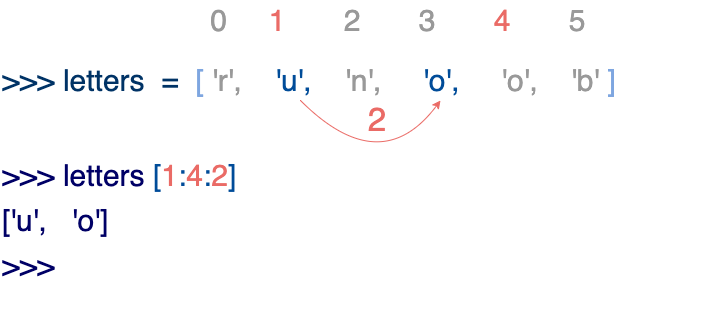

## 简介

List（列表） 是 Python 中使用最频繁的数据类型。

Python 中的列表底层是一个可以动态扩容的数组，列表元素在计算机内存中是连续存储的，所以可以实现随机访问

列表可以完成大多数集合类的数据结构实现。列表中元素的类型可以不相同，它支持数字，字符串甚至可以包含列表（所谓嵌套）。

列表是写在方括号 [] 之间、用逗号分隔开的元素列表。

和字符串一样，列表同样可以被索引和截取，列表被截取后返回一个包含所需元素的新列表。

列表截取的语法格式如下：

```python
#!/usr/bin/python3

list = [ 'abcd', 786 , 2.23, 'runoob', 70.2 ]
tinylist = [123, 'runoob']

print (list)            # 输出完整列表
print (list[0])         # 输出列表第一个元素
print (list[1:3])       # 从第二个开始输出到第三个元素
print (list[2:])        # 输出从第三个元素开始的所有元素
print (tinylist * 2)    # 输出两次列表
print (list + tinylist) # 连接列表

['abcd', 786, 2.23, 'runoob', 70.2]
abcd
[786, 2.23]
[2.23, 'runoob', 70.2]
[123, 'runoob', 123, 'runoob']
['abcd', 786, 2.23, 'runoob', 70.2, 123, 'runoob']
```
**与Python字符串不一样的是，列表中的元素是可以改变的：**

```python
>>> a = [1, 2, 3, 4, 5, 6]
>>> a[0] = 9
>>> a[2:5] = [13, 14, 15]
>>> a
[9, 2, 13, 14, 15, 6]
>>> a[2:5] = []   # 将对应的元素值设置为 []
>>> a
[9, 2, 6]
```
**注意：**

* 1、List写在方括号之间，元素用逗号隔开。
* 2、和字符串一样，list可以被索引和切片。
* 3、List可以使用+操作符进行拼接。
* 4、List中的元素是可以改变的。

Python 列表截取可以接收第三个参数，参数作用是截取的步长，以下实例在索引 1 到索引 4 的位置并设置为步长为 2（间隔一个位置）来截取字符串：



```python
def reverseWords(input):

    # 通过空格将字符串分隔符，把各个单词分隔为列表
    inputWords = input.split(" ")

    # 翻转字符串
    # 假设列表 list = [1,2,3,4],
    # list[0]=1, list[1]=2 ，而 -1 表示最后一个元素 list[-1]=4 ( 与 list[3]=4 一样)
    # inputWords[-1::-1] 有三个参数
    # 第一个参数 -1 表示最后一个元素
    # 第二个参数为空，表示移动到列表末尾
    # 第三个参数为步长，-1 表示逆向
    inputWords=inputWords[-1::-1]

    # 重新组合字符串 以空格作为分隔
    output = ' '.join(inputWords)

    return output

if __name__ == "__main__":
    input = 'I like runoob'
    rw = reverseWords(input)
    print(rw)
```
## 定义

```python
# 字面量
变量名 = [元素1, 元素2, 元素3, 元素4]

# 空列表
变量名 = []
变量名 = list()
```
`list`并不是一个普通的函数，它是创建列表对象的构造器

```python
items4 = list(range(1, 10))
items5 = list('hello')
print(items4)  # [1, 2, 3, 4, 5, 6, 7, 8, 9]
print(items5)  # ['h', 'e', 'l', 'l', 'o']
```
* 列表中的元素可以为不同的数据类型，支持嵌套
* Python 中的简单赋值绝不会复制数据。 当你将一个列表赋值给一个变量时，该变量将引用 *现有的列表*。你通过一个变量对列表所做的任何更改都会被引用它的所有其他变量看到。

```python
rgb = ["Red", "Green", "Blue"]
>>> rgba = rgb
>>> id(rgb) == id(rgba)  # 它们指向同一个对象
True
>>> rgba.append("Alph")
>>> rgb
["Red", "Green", "Blue", "Alph"]
```
## 操作

```python
name_list = ['Tom', 'Lily', 'Rose']
name_list[-1] # Rose
name_list[0] #Tom

lists = [name_list, name_list2]
lists[0][1] # Lily

# 查询索引
index = name_list.index("Tom") # 0

length = len(name_list)

# 修改索引处的值
name_list[0] = 'GO'

# 指定位置插入新元素，原有元素整体后移
name_list.insert(1, "bese")

# 追加元素
mylist.append("hqw")

# 追加一批元素
mylist.extend(name_list)
mylist+name_list

# 根据索引删除元素 del性能略优
del mylist[2]
element = mylist.pop(2)

# 根据元素删除 只会删除第一个, 不存在会抛出ValueError异常
mylist.remove("hqw")

# 默认弹出列表最后一个元素, 超出索引时抛出IndexError
value = mylist.pop()

# 清空列表
mlist.clear()

del mlist # 直接删除列表

# 统计元素在列表中的数量
count = mlist.count("lili")

max(list)
min(list)
```
## 判空

`if not list:` 不能用 `if list is None:`

## 遍历

```python
list = [1,2,3,4,5,6,7]

i = 0

while i < len(list):
    print(list[i])
    i += 1

for el in list:
    print(el)
```
for循环遍历过程中不能修改列表

可以使用while循环

```python
unconfirmed_users = ['alice', 'brian', 'candace']
confirmed_users = []
while unconfirmed_users:
    current_user = unconfirmed_users.pop()
    confirmed_users.append(current_user)

print(confirmed_users) # ['candace', 'brian', 'alice']
print(unconfirmed_users) # []
```
### 删除列表中所有的特定元素

```python
pets = ['dog', 'cat', 'dog', 'goldfish', 'cat', 'rabbit', 'cat']
print(pets)
while 'cat' in pets:
    pets.remove('cat')
```
### 使用 `remove()` 方法：

`remove()` 方法会根据给定的条件删除列表中的第一个匹配项。

```python

for node in apm_node_list[:]:  # 使用切片以避免在迭代时修改列表
    if node["node_type"] == "Mysql":
        apm_node_list.remove(node)
    elif node["node_type"] == "Elasticsearch":
        apm_node_list.remove(node)
```
### 使用 `del` 删除元素：

如果你知道节点的索引位置，可以使用 `del` 来删除元素。

```python
for index, node in enumerate(apm_node_list[:]):  # 使用切片以避免在迭代时修改列表
    if node["node_type"] == "Mysql":
        del apm_node_list[index]
    elif node["node_type"] == "Elasticsearch":
        del apm_node_list[index]
```
`enumerate(iterable, start=0)`  函数会返回一个枚举对象，它会生成一个元组，包含当前元素的索引和值。

## 排序

### 对列表永久性排序

```python
cars = ['bmw', 'audi', 'toyota']
cars.sort() # 改变了cars

cars.reverse()
cars.sort(reverse=True) # 逆序
```
### 对列表临时排序

```python
cars = ['bmw', 'audi', 'toyota']
new_cars = sorted(cars)

new_cars = sorted(cars, reverse=True)
```
## 对列表中对象进行排序

```python
import operator
from dataclasses import dataclass

# 定义一个简单的Person类
@dataclass
class Person:
    name: str
    age: int
    city: str

# 创建对象列表
people = [
    Person("Alice", 30, "New York"),
    Person("Bob", 25, "Chicago"),
    Person("Charlie", 35, "Boston"),
    Person("Diana", 28, "Seattle")
]

def main():
    print("原始列表:")
    for person in people:
        print(f"{person.name}: {person.age}岁, 来自{person.city}")

    # 方法1: 使用lambda函数按年龄排序
    sorted_by_age = sorted(people, key=lambda x: x.age)
    print("\n按年龄排序:")
    for person in sorted_by_age:
        print(f"{person.name}: {person.age}岁")

    # 方法2: 使用operator.attrgetter按姓名排序
    sorted_by_name = sorted(people, key=operator.attrgetter('name'))
    print("\n按姓名排序:")
    for person in sorted_by_name:
        print(f"{person.name}")

    # 方法3: 使用reverse参数进行降序排序
    sorted_by_age_desc = sorted(people, key=lambda x: x.age, reverse=True)
    print("\n按年龄降序排序:")
    for person in sorted_by_age_desc:
        print(f"{person.name}: {person.age}岁")

    # 方法4: 多级排序（先按城市，再按年龄）
    sorted_multilevel = sorted(people, key=lambda x: (x.city, x.age))
    print("\n先按城市再按年龄排序:")
    for person in sorted_multilevel:
        print(f"{person.name}: {person.age}岁, 来自{person.city}")

if __name__ == "__main__":
    main()
```
## 反转

```python
cars = ['bmw', 'audi', 'toyota']
cars.reverse()
```
## 长度

```python
len(cars)
```
## range()创建数字列表

```python
for value in range(1, 6):
    print(value) # 1 2 3 4 5

numbers = list(range(1, 6)) # 1, 2, 3, 4, 5

numbers = list(range(2, 8, 2)) # 2, 4, 6
```
## 统计

```python
min(digits)
max(digits)
sum(digits)
```
## 列表生成式

不仅优雅而且性能优于for循环, 因为有专门的生成式指令`LIST\_APPEND`, 而for循环调用`LOAD\_METHOD`和`CALL\_METHOD`相对耗时

```python
squares = []
for num in range(1, 11):
    squares.append(num**2)

# 当使用列表解析
squares = [num**2 for num in range(1,11)]
```
## 切片

```python
players = ['charles', 'martina', 'michael', 'florence', 'eli']

print(players[0:3]) # 'charles', 'martina', 'michael'
print(players[:4]) # 'charles', 'martina', 'michael', 'florence'
print(player[2:]) # 'michael', 'florence', 'eli'
print(player[-3:]) # 'michael', 'florence', 'eli'
```
### 遍历切片

```python
players = ['charles', 'martina', 'michael', 'florence', 'eli']

for player in players[:3]:
    print(player)
# 'charles', 'martina', 'michael'
```
### 复制列表

```python
my_foods = ['pizza', 'falafel', 'carrot cake']

# 引用拷贝，指向同一个对象
frind_foods = my_foods

 # 创建了一个新的列表相当于浅拷贝
frind_foods = my_foods[:]
new_list = list(my_foods)

# 浅拷贝: 会创建对象(内存地址不同),但嵌套数据会指向原来的内存地址
import copy
li = [1,2,3,[4,5,6]]
li2 = copy.copy(li)
li.append(7) # li2没有7
li[3].append(7) # li2 变成[1, 2, 3, [4, 5, 6, 7]]

# 深拷贝: 跟原来的对象没关系
import copy
li2 = copy.deepcopy(li))

```
* 赋值: 数据完全共享
* 浅拷贝: 外层地址不同, 内层地址相同. 拷贝速度快, 占用空间小, 拷贝效率高, 数据半共享
* 深拷贝: 数据完全不共享
