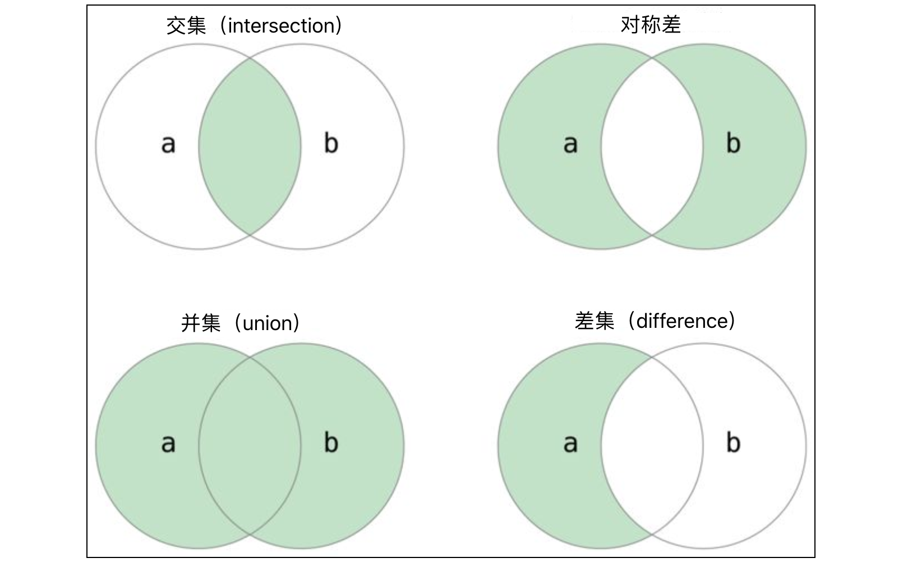

* 无序
* 不可重复
* 不支持索引访问
* 允许修改

集合中的元素必须是`hashable`类型，所谓`hashable`类型指的是能够计算出哈希码的数据类型，通常不可变类型都是`hashable`类型，如整数（`int`）、浮点小数（`float`）、布尔值（`bool`）、字符串（`str`）、元组（`tuple`）等。可变类型都不是`hashable`类型，因为可变类型无法计算出确定的哈希码，所以它们不能放到集合中。例如：我们不能将列表作为集合中的元素；同理，由于集合本身也是可变类型，所以集合也不能作为集合中的元素。我们可以创建出嵌套列表（列表的元素也是列表），但是我们不能创建出嵌套的集合

## 定义

```python
my_set = {"a", "b", "c", "a"}
my_set2 = set()
set4 = set([1, 2, 2, 3, 3, 3, 2, 1])
set5 = {num for num in range(1, 20) if num % 3 == 0 or num % 7 == 0}
```
## 操作

```python
my_set.add("op")
my_set.add("b")
print(my_set) # {'a', 'op', 'b', 'c'}

my_set.update(["a","b"])

# 删除
my_set.remove("a")
my_set.discard('op')

# 随机取出一个
st = my_set.pop()

my_set.clear()

len(set3)
max(set3)
min(set3)

# 判断集合有没有重复元素
set1 = {'Java', 'Python', 'C++', 'Kotlin'}
set2 = {'Kotlin', 'Swift', 'Java', 'Dart'}
set3 = {'HTML', 'CSS', 'JavaScript'}
print(set1.isdisjoint(set2))  # False
print(set1.isdisjoint(set3))  # True
```
## 遍历

集合不支持while循环，因为没有索引

```python
for ele in set1:
    print(ele)
```
## 运算

### 成员运算

可以通过成员运算`in`和`not in` 检查元素是否在集合中，代码如下所示。

```python
set1 = {11, 12, 13, 14, 15}
print(10 in set1)      # False
print(15 in set1)      # True
set2 = {'Python', 'Java', 'C++', 'Swift'}
print('Ruby' in set2)  # False
print('Java' in set2)  # True
```
### 二元运算

集合的二元运算主要指集合的交集、并集、差集、对称差等运算，这些运算可以通过运算符来实现，也可以通过集合类型的方法来实现，代码如下所示。



```python
set1 = {1, 2, 3, 4, 5, 6, 7}
set2 = {2, 4, 6, 8, 10}

# 交集
print(set1 & set2)                      # {2, 4, 6}
print(set1.intersection(set2))          # {2, 4, 6}

# 并集
print(set1 | set2)                      # {1, 2, 3, 4, 5, 6, 7, 8, 10}
print(set1.union(set2))                 # {1, 2, 3, 4, 5, 6, 7, 8, 10}

# 差集
print(set1 - set2)                      # {1, 3, 5, 7}
print(set1.difference(set2))            # {1, 3, 5, 7}

# 对称差
print(set1 ^ set2)                      # {1, 3, 5, 7, 8, 10}
print(set1.symmetric_difference(set2))  # {1, 3, 5, 7, 8, 10}
```
通过上面的代码可以看出，对两个集合求交集，`&`运算符和`intersection`方法的作用是完全相同的，使用运算符的方式显然更直观且代码也更简短。需要说明的是，集合的二元运算还可以跟赋值运算一起构成复合赋值运算，例如：`set1 |= set2`相当于`set1 = set1 | set2`，跟`|=`作用相同的方法是`update`；`set1 &= set2`相当于`set1 = set1 & set2`，跟`&=`作用相同的方法是`intersection\_update`，代码如下所示。

```python
set1 = {1, 3, 5, 7}
set2 = {2, 4, 6}
set1 |= set2
# set1.update(set2)
print(set1)  # {1, 2, 3, 4, 5, 6, 7}
set3 = {3, 6, 9}
set1 &= set3
# set1.intersection_update(set3)
print(set1)  # {3, 6}
set2 -= set1
# set2.difference_update(set1)
print(set2)  # {2, 4}
```
### 比较运算

两个集合可以用`==`和`!=`进行相等性判断，如果两个集合中的元素完全相同，那么`==`比较的结果就是`True`，否则就是`False`。如果集合`A`的任意一个元素都是集合`B`的元素，那么集合`A`称为集合`B`的子集，即对于 ∀a∈A ，均有 a∈B ，则 A⊆B ，`A`是`B`的子集，反过来也可以称`B`是`A`的超集。如果`A`是`B`的子集且`A`不等于`B`，那么`A`就是`B`的真子集。Python 为集合类型提供了判断子集和超集的运算符，其实就是我们非常熟悉的`<`、`<=`、`>`、`>=`这些运算符。当然，我们也可以通过集合类型的方法`issubset`和`issuperset`来判断集合之间的关系，代码如下所示。

```python
set1 = {1, 3, 5}
set2 = {1, 2, 3, 4, 5}
set3 = {5, 4, 3, 2, 1}

print(set1 < set2)   # True
print(set1 <= set2)  # True
print(set2 < set3)   # False
print(set2 <= set3)  # True
print(set2 > set1)   # True
print(set2 == set3)  # True

print(set1.issubset(set2))    # True
print(set2.issuperset(set1))  # True
```
**说明**：上面的代码中，`set1 < set2`判断`set1`是不是`set2`的真子集，`set1 <= set2`判断`set1`是不是`set2`的子集，`set2 > set1`判断`set2`是不是`set1`的超集。当然，我们也可以通过`set1.issubset(set2)`判断`set1`是不是`set2`的子集；通过`set2.issuperset(set1)`判断`set2`是不是`set1`的超集。

## 不可变集合

Python 中还有一种不可变类型的集合，名字叫`frozenset`。`set`跟`frozenset`的区别就如同`list`跟`tuple`的区别，`frozenset`由于是不可变类型，能够计算出哈希码，因此它可以作为`set`中的元素。除了不能添加和删除元素，`frozenset`在其他方面跟`set`是一样的，下面的代码简单的展示了`frozenset`的用法。

```python
fset1 = frozenset({1, 3, 5, 7})
fset2 = frozenset(range(1, 6))
print(fset1)          # frozenset({1, 3, 5, 7})
print(fset2)          # frozenset({1, 2, 3, 4, 5})
print(fset1 & fset2)  # frozenset({1, 3, 5})
print(fset1 | fset2)  # frozenset({1, 2, 3, 4, 5, 7})
print(fset1 - fset2)  # frozenset({7})
print(fset1 < fset2)  # False
```

