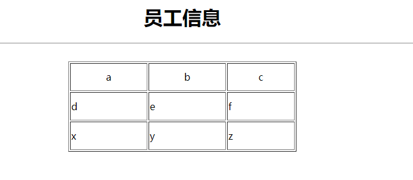
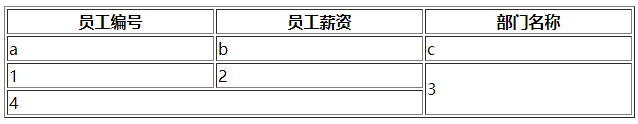

# HTML概要

[📎JavaWeb随堂讲义.pdf](https://www.yuque.com/attachments/yuque/0/2024/pdf/758713/1704811247573-d6b6b5a0-8e7d-43f9-825f-6fbceb7e95be.pdf)

## 系统结构：

### B/S架构（以后主要走的方向是这个。）

Browser / Server      （浏览器/服务器的交互形式。）

Browser支持哪些语言：HTML CSS JavaScript

写HTML CSS JavaScript代码的这波人职位叫做：WEB前端开发工程师。（Java程序员目前来看也需要会一些前端的东西。）

前端页面上的图片需要UI设计师完成。（PS对java程序员来说没有太高的要求。）

S是服务器端Server，Server端的语言很多：C C++ Java python.....（我们主要是使用Java语言完成服务器端的开发）

B/S架构的系统有什么优点和缺点？

   优点：升级方便，只升级服务器端代码即可。维护成本低。

   缺点：速度慢、体验不好、界面不炫酷

企业内部的解决方案都是采用B/S架构的系统，因为企业内部办公需要的一些系统不需要炫酷，不需要特别好的用户体验，只要能做数据的增删改查即可。并且企业内部更注重维护的成本。

B/S架构的系统有哪些代表？

   京东

   百度

   天猫

   ....

###  C/S架构 Client / Server（客户端/服务器端的交互形式。）

  缺点：升级麻烦，维护成本较高。

  优点：速度快，体验好，界面炫酷。（娱乐型的系统多数是C/S架构的。）

  常见的C/S架构的系统：

   QQ

   微信

   支付宝

   ....

# 什么是HTML？怎么开发HTML？怎么运行HTML？

* HTML: Hyper Text Markup Language （超文本标记语言）
* 解释型语言，不会报错
* 由大量的标签组成，每一个标签都有开始标签和结束标签。
* HTML开发的时候使用普通的文本编辑器就行，创建的文件扩展名是.html或者.htm

 HTML也有专业的开发工具，例如：DreamWeaver、HBuilder.....

* 直接采用浏览器打开HTML文件就是运行。

## HTML是谁制定的?

W3C：世界万维网联盟

W3C制定了HTML的规范，每个浏览器生产厂家都会遵守规范。HTML程序员也会按照这个规范去写代码。

HTML规范目前最高的版本是：HTML5.0，简称H5.

我们这里学习HTML4.0（主要是学习一下HTML的基础用法。）

W3C制定了很多规范：

HTML/XML/http协议/https协议......

为了方便中国web前端程序员的开发，提供大量的帮助文档。为开发提供方便。

w3school:先出现的，和W3C没有关系

w3cschool：后出现的，和W3C没有关系

# HTML基础

```
<!--
	1.这是html注释
	2.加上以下代码的第一行表示html5语法，去掉就是html4
	3.html不区分大小写
-->
<!doctype html>

<!--
	<html> 标签告知浏览器这是一个 HTML 文档。
	<html> 标签是 HTML 文档中最外层的元素。
	<html> 标签是所有其他 HTML 元素（除了 <!DOCTYPE> 标签）的容器。
-->
<html>
	<head>
		<title> 网页标题 </title>
    <meta charset="UTF-8">
	</head>

	<body>
		网页主体
	</body>
</html>
```
## html基本标签

```
<p>
  ...段落标签
</p>

<h1>标题字</h1> h1~h6

<br>换行标签，是一个独目标签

<hr>横线标记 color和width都是标签属性
<hr color="red" width = "50%">
<hr color='green' width=30%>语法松散

<pre>预留格式
	...
</pre>

<del>删除字</del>

<ins>插入字</ins>

<b>粗体字</b>

<i>斜体字</i>

<small>小号字</small>

<cite>引用字体</cite>

10<sup>2</sup>右上角加字
10<sub>m</sub>右下角加字

<font color = "red" size = "50" > 字体标签 </font>

<code>计算机输出文本</code>
<kbd>键盘输入</kbd>
<tt>打字机文本</tt>
<samp>计算机代码样本</samp>
<var>计算机变量</var>
<address>
  Written by <a href="madeinhqw@163.com">Sagiri Huang</a>.<br>
  visit us at:<br>
  ChangNing, ShangHai
  CHN
</address>

```
## 实体符号

```
实体符号以&开始，以;结束

b<a>c 结果为：bc
b&lt;a&gt;c 结果为 "b<a>c"

空格
&nbsp
```
## 设置背景色，背景图片，图片

alt 属性用来为图像定义一串预备的可替换的文本。

height（高度） 与 width（宽度）属性用于设置图像的高度与宽度。属性值默认单位为像素:

```
<body bgcolor="red" background = "img/bd_log1.png">
</body>

<body>
    
</body>
```
## 超链接

B--请求-->S：request

S--响应-->B：response

```
<!DOCTYPE html>
<html lang="en">
<head>
    <meta charset="UTF-8">
    <title>超链接</title>
</head>
<body>
  	<!--<a>是链接 href是链接的属性-->
    <a href = "https://www.baidu.com/">百度</a>
    <br>
    <a href = "https://www.bilibili.com/">
        
    </a>
    <br>
    <!--
        target属性可取值
          _blank:新窗口
          _self：当前窗口(默认)
          _top：顶级窗口
          _parent：父窗口
    -->
    <a href = "https://www.bilibili.com/" target = "_blank">
        
    </a>

</body>
</html>
```
## 在HTML文档中插入ID:

<a id="tips">有用的提示部分</a>

在HTML文档中创建一个链接到"有用的提示部分(id="tips"）"：

<a href="#tips">访问有用的提示部分</a>

或者，从另一个页面创建一个链接到"有用的提示部分(id="tips"）"：

<a href="https://www.runoob.com/html/html-links.html#tips">
访问有用的提示部分</a>

```
<!DOCTYPE html>
<html>
<head>
<meta charset="utf-8">
<title>菜鸟教程(runoob.com)</title>
</head>
<body>

<p>
<a href="#C4">查看章节 4</a>
</p>

<h2>章节 1</h2>
<p>这边显示该章节的内容……</p>

<h2>章节 2</h2>
<p>这边显示该章节的内容……</p>

<h2>章节 3</h2>
<p>这边显示该章节的内容……</p>

<h2><a id="C4">章节 4</a></h2>
<p>这边显示该章节的内容……</p>

</body>
</html>
```
# HTML头部

HTML <head> 元素

<head> 元素包含了所有的头部标签元素。在 <head>元素中你可以插入脚本（scripts）, 样式文件（CSS），及各种meta信息。

可以添加在头部区域的元素标签为: <title>, <style>, <meta>, <link>, <script>, <noscript> 和 <base>。

### <title>元素

<title> 在 HTML/XHTML 文档中是必须的。

<title> 元素:

* 定义了浏览器工具栏的标题
* 当网页添加到收藏夹时，显示在收藏夹中的标题
* 显示在搜索引擎结果页面的标题

```
<!DOCTYPE html>
<html>
<head>
<meta charset="utf-8">
<title>文档标题</title>
</head>

<body>
文档内容......
</body>

</html>
```
### HTML <link> 元素

<link> 标签定义了文档与外部资源之间的关系。

<link> 标签通常用于链接到样式表:

```
<head>
<link rel="stylesheet" type="text/css" href="mystyle.css">
</head>
```
### HTML<base>元素

<base> 标签描述了基本的链接地址/链接目标，该标签作为HTML文档中所有的链接标签的默认链接:、

```
<head>
<base href="http://www.runoob.com/images/" target="_blank">
</head>
```
### HTML <style> 元素

<style> 标签定义了HTML文档的样式文件引用地址.

在<style> 元素中你也可以直接添加样式来渲染 HTML 文档:

```
<head>
<style type="text/css">
body {background-color:yellow}
p {color:blue}
</style>
</head>
```
### HTML <meta> 元素

meta标签描述了一些基本的元数据。

<meta> 标签提供了元数据.元数据也不显示在页面上，但会被浏览器解析。

META 元素通常用于指定网页的描述，关键词，文件的最后修改时间，作者，和其他元数据。

元数据可以使用于浏览器（如何显示内容或重新加载页面），搜索引擎（关键词），或其他Web服务。

<meta> 一般放置于 <head> 区域

```
为搜索引擎定义关键词:

<meta name="keywords" content="HTML, CSS, XML, XHTML, JavaScript">
为网页定义描述内容:

<meta name="description" content="免费 Web & 编程 教程">
定义网页作者:

<meta name="author" content="Runoob">
每30秒钟刷新当前页面:

<meta http-equiv="refresh" content="30">
```
### HTML <script> 元素

<script>标签用于加载脚本文件，如： JavaScript。

# 表格

```
<center><h1>员工信息</h1></center>
<table border = "1px" width = "30" height= "150px">
	<tr>
    <th>Header1</th> 表头
    <th>Header2</th>
    <th>Header3</th>
  <tr>
  <tr align = "center"> 对齐方式居中
    <td>a</td>
    <td>b</td>
    <td>c</td>
  </tr>
  <tr>
    <td>d</td>
    <td>e</td>
    <td>f</td>
  </tr>
  <tr>
    <td>x</td>
    <td>y</td>
    <td>z</td>
  </tr>
</table>
```


### 单元格合并

```
<!doctype html>
<html>
  <head>
    <title>表格单元格合并</title>
  </head>
  <body>
    <table border = "1px" width = "50%">
      <tr>
        <th>员工编号</th>
        <th>员工薪资</th>
        <th>部门名称</th>
      </tr>
      <tr>
        <td>a</td>
        <td>b</td>
        <td>c</td>
      </tr>

      <tr>
        <td>1</td>
        <td>2</td>
        <td rowspan ="2">3</td>
      </tr>

      <tr>
        <td colspan = "2">4</td>
      </tr>
    </table>
  </body>
</html>
```


# 列表

### HTML 有序列表

同样，有序列表也是一列项目，列表项目使用数字进行标记。 有序列表始于 <ol> 标签。每个列表项始于 <li> 标签。

列表项使用数字来标记。

### HTML无序列表

无序列表是一个项目的列表，此列项目使用粗体圆点（典型的小黑圆圈）进行标记。

无序列表使用 <ul> 标签

```
<!DOCTYPE html>
<html>
	<head>
		<meta charset="utf-8">
		<title>列表</title>
	</head>
	<body>
		<!--有序列表-->
		<ol type="I"> 以罗马字母为序号
			<li>水果
				<ol type="a" start="c"> 以abcd为序号 从c开始
					<li>苹果</li>
					<li>西瓜</li>
					<li>桃子</li>
				</ol>
			</li>
			<li>蔬菜
				<ol>
					<li>西红柿</li>
				</ol>
			</li>
			<li>甜点</li>
		</ol>

		<!--无序列表-->
		<ul type="circle">
			<li>中国
				<ul type="square">
					<li>北京
						<ul type="disc">
							<li>东城区</li>
							<li>西城区</li>
							<li>海淀区</li>
							<li>朝阳区</li>
						</ul>
					</li>
					<li>天津</li>
					<li>上海</li>
				</ul>
			</li>
			<li>美国</li>
			<li>日本</li>
		</ul>
	</body>
</html>

```
# HTML区块

HTML 可以通过 <div> 和 <span>将元素组合起来。

### HTML 区块元素

大多数 HTML 元素被定义为**块级元素**或**内联元素**。

块级元素在浏览器显示时，通常会以新行来开始（和结束）。

实例: <h1>, <p>, <ul>, <table>

### HTML 内联元素

内联元素在显示时通常不会以新行开始。

实例: <b>, <td>, <a>, 

### HTML <div> 元素

HTML <div> 元素是块级元素，它可用于组合其他 HTML 元素的容器。

<div> 元素没有特定的含义。除此之外，由于它属于块级元素，浏览器会在其前后显示折行。

如果与 CSS 一同使用，<div> 元素可用于对大的内容块设置样式属性。

<div> 元素的另一个常见的用途是文档布局。它取代了使用表格定义布局的老式方法。使用 <table> 元素进行文档布局不是表格的正确用法。<table> 元素的作用是显示表格化的数据。

### HTML <span> 元素

HTML <span> 元素是内联元素，可用作文本的容器

<span> 元素也没有特定的含义。

当与 CSS 一同使用时，<span> 元素可用于为部分文本设置样式属性。

### HTML 分组标签

|  |  |
| --- | --- |
| 标签 | 描述 |
| [<div>](https://www.runoob.com/tags/tag-div.html) | 定义了文档的区域，块级 (block-level) |
| [<span>](https://www.runoob.com/tags/tag-span.html) | 用来组合文档中的行内元素， 内联元素(inline) |

# 表单

1.表单作用：

收集用户信息。表单展现后，用户填写表单，点击提交按钮提交数据给服务器

2.怎么画一个表单：

使用form标签

3.一个网页可以有多个form

4.表单要提交数据给服务器，form有一个action属性，用来指定服务器地址

action属性用来指定数据提交给哪个服务器

action属性和超链接中的href属性一样。都可以向服务器发送请求（request）

5.<http://192.168.111.3:8080/oa/save> 这是请求路径，表单提交数据最终提交给：

    192.168.111.3机器上的8080端口对应的软件。

```
<!DOCTYPE html>
<html>
	<head>
		<meta charset="utf-8">
		<title>表单form</title>
	</head>
	<body>
		<form action="http://192.168.111.3:8080/oa/save">
			<!-- 画按钮可以使用input输入域，type="submit"的时候表示该按钮是一个提交按钮，具有提交表单的能力。-->
			<!-- 对于按钮来说，按钮的value属性用来指定按钮上显示的文本信息。-->
      <!--text 文本框
					password 密码框
					checkbox 复选框
					radio 单选按钮
			-->
			<input type="submit" value="登录"/>
			<!--这是一个普通按钮，不具备提交表单的能力。-->
			<input type="button" value="设置按钮上显示的文本"/>
		</form>

		<!--这个按钮和普通的超链接没什么太大的区别。（超链接和表单都可以向服务器发送请求，只不过表单发送请求的同时可以携带数据。）-->
		<form action="http://www.baidu.com">
			<input type="submit" value="百度" />
		</form>

		<form action="http://localhost:8080/jd/login">
			用户名<input type="text" /><br>
			密码<input type="password" /><br>
			<input type="submit" value="登录" />
		</form>

		<!--
			表单是以什么格式提交数据给服务器的？
				http://localhost:8080/jd/login?username=abc&userpwd=111
				格式：action?name=value&name=value&name=value&name=value&name=value...
				W3C的HTTP协议规定的，必须以这种格式提交给服务器。

			重点强调：表单项写了name属性的，一律会提交给服务器。不想提交这一项，就不要写name属性。

			文本框和密码框的value不需要程序员指定，用户输入什么value就是什么。

			当name没有写的时候，该项不会提交给服务器。
			但是当value没有写的时候，value的默认值是空字符串""，会将空字符串提交给服务器。java代码得到的是：String username = "";
		-->
		<form action="http://localhost:8080/jd/login">
			<table>
				<tr>
					<td>用户名</td>
					<td><input type="text" name="username" /></td>
				</tr>
				<tr>
					<td>密码</td>
					<td><input type="password" name="userpwd" /></td>
				</tr>
				<tr align="center">
					<td colspan="2">
						<input type="submit" value="登录" />
						&nbsp;&nbsp;&nbsp;&nbsp;&nbsp;&nbsp;
						<input type="reset" value="清空" />
					</td>
				</tr>
			</table>
		</form>

		<!--submit必须放到form标签内部-->
		<input type="submit" value="登录" />

		<!--reset必须放到form标签内部-->
		<input type="reset" value="清空" />

		<form></form>
	</body>
</html>

```
#### 用户注册表单

```
<!DOCTYPE html>
<html>
	<head>
		<meta charset="utf-8">
		<title>用户注册的表单</title>
	</head>
	<body>
		<!--
			用户注册：
				用户名
				姓名
				密码
				确认密码
				性别
				兴趣爱好
				学历
				简介

			form表单method属性：
				get:采用get方式提交的时候，用户提交的信息会显示在浏览器的地址栏上。
				post：采用post方式提交的时候，用户提交的信息不会显示在浏览器地址栏上。
				当用户提交的信息中含有敏感信息，例如：密码，建议采用post方式提交。

			method属性不指定，或者指定get，这种情况下都是get。
			只有当method属性指定为post的时候才是post请求。
			剩下所有的请求都是get请求。

			post提交的时候提交的数据格式和get还是一样的，只不过不再地址栏上显示出来。
			POST提交的数据还是：name=value&name=value&name=value.....
		-->
		<form action="http://localhost:8080/jd/register">
			用户名
			<input type="text" name="username"/>
			<br>
			密码
			<input type="password" name="userpwd" />
			<br>
			确认密码
			<input type="password"/>
			<br>
			性别
			<input type="radio" name="gender" value="1" />男
			<input type="radio" name="gender" value="0" checked/>女 <!--单选按钮的value必须手动指定-->
			<br>
			兴趣爱好
			<input type="checkbox" name="interest" value="smoke"/>抽烟
			<input type="checkbox" name="interest" value="drink" checked/>喝酒
			<input type="checkbox" name="interest" value="fireHair" checked/>烫头
			<br>
			学历
			<select name="grade">
				<option value="gz">高中</option>
				<option value="dz">大专</option>
				<option value="bk" selected>本科</option> <!--默认选中-->
				<option value="ss">硕士</option>
			</select>
			<br>
			简介 <!--文本域，文本域没有value属性，用户填写的内容就是value-->
			<textarea rows="10" cols="60" name="introduce"></textarea>
			<br>
			<input type="submit" value="注册" />
			<input type="reset" value="清空" />
		</form>

		<!--超链接也可以提交数据给服务器，但是提交的数据都是固定不变的。-->
		<!--超链接是get请求。不是post请求。-->
		<a href="http://localhost:8080/oa/save?username=zhangsan&password=111">提交</a>

	</body>
</html>

<!--
http://localhost:8080/jd/register?username=jack&userpwd=111&gender=1&interest=smoke&interest=drink&grade=ss&introduce=jackgoodman
-->

```
#### 下拉菜单支持多选

```
<select multiple="multiple" size="2">
			<option>河北省</option>
			<option>河南省</option>
			<option>山东省</option>
			<option>山西省</option>
 </select>
```
#### file和hiden控件

```
		<!--file控件：文件上传专用。-->
		<input type="file" />

		<form action="http://localhost:8080/oa/save">

			<!--隐藏域：网页上看不到，但是表单提交的时候数据会自动提交给服务器。-->
			<input type="hidden" name="userid" value="111" />

			用户代码<input type="text" name="usercode" />

			<input type="submit" value="提交" />

		</form>
```
#### readonly和disabled

```
	<!--
			readonly和disabled相同点：都是只读不能修改。
			但是readonly可以提交给服务器，disabled数据不会提交（即使有name属性也不会提交。）
		-->
		<form action="http://localhost:8080/taobao/save">
			用户代码<input type="text" name="usercode" value="110" readonly />
			<br>
			用户姓名<input type="text" name="username" value="zhangsan" disabled />
			<br>
			<input type="submit" value="提交数据" />
		</form>
```

```
		<!--
			maxlength 设置文本框中可输入的字符数量。
		-->
		<input type="text" maxlength="3" />
```
# id属性

```
		<!--
			1、在HTML文档当中，任何元素（节点）都有id属性，id属性是该节点的唯一标识。所以在同一个HTML文档当中id值不能重复。
			2、注意：表单提交数据的时候，只和name有关系，和id无关。
			3、id有什么用？
				javascript语言：可以对HTML文档当中的任意节点进行增删改操作。
				javascript可以对HTML文档当中的任意节点进行增删改，那么增删改之前需要先拿到这个节点，通常我们通过id来拿节点对象。
				id的存在让我们获取元素（节点）更方便。
			4、HTML文档是一棵树，树上有很多节点，每一个节点都有唯一的id。
				javascript主要就是对这棵DOM树上的节点进行增删改的。
				DOM(Document)树。
		-->
		<form id="myform">
			<input type="text" id="username" name="username"/>
			<input type="password" id="userpwd" name="userpwd"/>

			<!--id就是节点的身份证号码，不能重复。-->
			<!--
			<input type="text" id="username" />
			-->
		</form>
```

```
<!--
			1、div和span是什么？有什么用？
				* div和span都可以称为“图层”
				* 图层的作用是为了保证页面可以灵活的布局。
				* 图层就是一个一个的盒子，div嵌套div就是盒子套盒子。
				* div和span是可以定位的，只要定下div的左上角的x轴和y轴坐标即可。
			2、其实最早的网页是采用table进行布局的，但是table不灵活，太死板。
			现代的网页开发中div布局使用最多，几乎很少使用table进行布局了。

			3、div和span的区别？
				div独自占用一行（默认情况下）
				span不会独自占用一行。
		-->
		<div id="div1">我是一个DIV</div>
		<div id="div2">我是一个DIV</div>

		<span id="span1">我是一个SPAN标签</span>
		<span id="span2">我是一个SPAN标签</span>

		<div id="div3">
			<div>
				<div>test</div>
			</div>
		</div>
```

